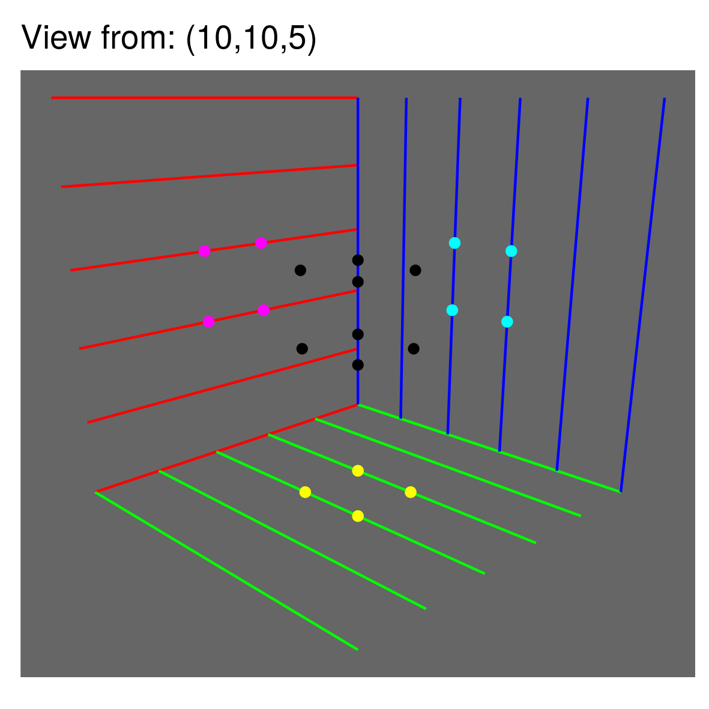

This library makes 3D geometry easy so that you can easily build 3D plots using
ggplot. The below is a set of plots built using ggplot with the underlying
data processed using this library and stitched together into a GIF to emphasise
the 3D-ness.

```{r Preview, cache=FALSE, echo=FALSE, warning=FALSE, message=FALSE, fig.width = 15, fig.height = 8, results = 'asis'}

cat('')

```

```{r Setup, cache=FALSE, echo=FALSE, warning=FALSE, message=FALSE, fig.width = 15, fig.height = 8, results = 'hide'}

rm(list = ls())

# functionality
library(POV)
library(ggplot2)

# for markdown
library(knitr)

```

```{r Parms, cache=FALSE, echo=FALSE, warning=FALSE, message=FALSE, fig.width = 15, fig.height = 8, results = 'hide'}

# the point from where we'll view the data
mFinalVieWCoordinates = cbind(10,10,10)

# the point which dictates the screen on which we'll view the data
mFinalScreenCoordinates = cbind(0,0,0)

# the data we'll be plotting
df = data.frame(
   x = c(0,0,0,0,1,1,1,1) + 2,
   y = c(0,0,1,1,0,0,1,1) + 2,
   z = c(0,1,0,1,0,1,0,1) + 2
)

# can't yet model infinity, which is actually what we want. 999 is just some large number
nInfinitySubstitute = 999

# cosmetic
cBackgroundColor = '#666666'

opts_chunk$set(
   dev.args=list(
      bg=cBackgroundColor
   )
)
```

## Data

The data in this example is just a cube with eight corners specified.

```{r Data, cache=FALSE, echo=FALSE, warning=FALSE, message=FALSE, fig.width = 15, fig.height = 8, results = 'asis'}
kable(df, format = 'markdown')
```

## Shadows on the three planes

### Getting the coordinates in the 3D space

We calculate the shadow of the data on a plane as if the light source was
very large, and very far away from the points, perpendicular to the plane. Think
of it as the noon sun casting a shadow on the ground where the ground is the plane.
In any other situation, the shadow will be a little distorted. Feel free to play
with the parameters to see the results

We will do this thrice, once for each plane - the XY, the YZ, and the XZ plane.

The projection on the XY plane is:

```{r XYShadow, cache=FALSE, echo=FALSE, warning=FALSE, message=FALSE, fig.width = 15, fig.height = 8, results = 'hide'}

# The screen coordinates, the object and the light source coordinates have to be 
# in line for the shadow to be correctly projected - analogous to the noon sun 
# casting a shadow on the ground. In this case, the line stretches parallel to
# the Z axis with its x and y coordinates equal to the centre of the object.

# You can try playing with the coordinates to understand the distortion in the 
# shadows

# XY coordinates set to the midpoint of the object.
# Since this is a projection on the XY plane, we set the Z cooridnate to 0.
mScreenCoordinates = cbind(
   mean(range(df['x'])),
   mean(range(df['y'])),
   mean(range(df['z']))
)
mScreenCoordinates[3] = 0

# The light source is far away so we set Z cooridnate to a large value.
# Not that the x and y coordinates are the same as the screen
mOriginCoordinates = mScreenCoordinates
mOriginCoordinates[3] = nInfinitySubstitute

# calculate the equation of the plane for the screen
# ( which, we know, should be the xy plane so 0x + 0y + z = 0 )
nScreenPlaneCoefficients = c(
   mScreenCoordinates - mOriginCoordinates,
   sum( 
       ( mScreenCoordinates - mOriginCoordinates ) * mScreenCoordinates 
   )
)

# Getting the shadow coordinates
mdfprojectionxy = fGetProjectionsOnPlane(
    as.matrix(df),
    mOriginCoordinates,
    nScreenPlaneCoefficients
) 

```

```{r XYShadowPreview, cache=FALSE, echo=FALSE, warning=FALSE, message=FALSE, fig.width = 15, fig.height = 8, results = 'asis'}

kable(mdfprojectionxy, format = 'markdown')
```

You can see the z coordinate being zero, and the x and y coordinates being 
four points repeated twice each with a minor change in the coordinates. This 
difference between the almost duplicates is because our light sources is not 
actually at infinity but so the change in the z coordinates causes a really
small change in the shadow's position as well. You can also think of it as you 
seeing a cube from very far away from the same point as where the light source 
is. You'd almost see only a square but in actuality there is just a little bit
of the rest of the cube that also sticks out from begind the face that you can
see. Try reducing the value of the nInfinitySubstitute variable and see the 
difference.

I'd plot it but it just looks like a square which you can sort of make out from
the data so not bothering.

We similarly also calculate shadows on the other two planes

```{r YZShadow, cache=FALSE, echo=FALSE, warning=FALSE, message=FALSE, fig.width = 15, fig.height = 8, results = 'hide'}

mScreenCoordinates = cbind(
   mean(range(df['x']))/2,
   mean(range(df['y']))/2,
   mean(range(df['z']))/2
)
mOriginCoordinates = mScreenCoordinates
mScreenCoordinates[2] = 0
mOriginCoordinates[2] = nInfinitySubstitute

nScreenPlaneCoefficients = c(
   mScreenCoordinates - mOriginCoordinates,
   sum( 
       ( mScreenCoordinates - mOriginCoordinates ) * mScreenCoordinates 
   )
)

mdfprojectionxz = fGetProjectionsOnPlane(
    as.matrix(df),
    mOriginCoordinates,
    nScreenPlaneCoefficients
) 

```

```{r XZShadow, cache=FALSE, echo=FALSE, warning=FALSE, message=FALSE, fig.width = 15, fig.height = 8, results = 'hide'}

mScreenCoordinates = cbind(
   mean(range(df['x']))/2,
   mean(range(df['y']))/2,
   mean(range(df['z']))/2
)
mOriginCoordinates = mScreenCoordinates
mScreenCoordinates[1] = 0
mOriginCoordinates[1] = nInfinitySubstitute

nScreenPlaneCoefficients = c(
   mScreenCoordinates - mOriginCoordinates,
   sum( 
       ( mScreenCoordinates - mOriginCoordinates ) * mScreenCoordinates 
   )
)
mdfprojectionyz = fGetProjectionsOnPlane(
    as.matrix(df),
    mOriginCoordinates,
    nScreenPlaneCoefficients
) 

```


### Getting the shadow coordinates on the screen

Now that we have the 3D coordinates of the shadows, we can calculate what it
would look like when viewed from a particular point.

```{r ShadowProjections, cache=FALSE, echo=FALSE, warning=FALSE, message=FALSE, fig.width = 15, fig.height = 8, results = 'hide'}

mdfprojectionxy = fGetTransformedCoordinatesDiscard(
    mdfprojectionxy, # data to project on the screen
    mFinalVieWCoordinates, # origin coordinates
    mFinalScreenCoordinates, # screen coordinates
    mZAxisVector = c(0,0,1), # which way is up for the viewer
    iTreatAs = 1 # treat each point as an independent point, not part of a path or a polygon
) 
mdfprojectionyz = fGetTransformedCoordinatesDiscard(
    mdfprojectionyz,
    mFinalVieWCoordinates,
    mFinalScreenCoordinates,
    mZAxisVector = c(0,0,1),
    iTreatAs = 1
) 
mdfprojectionxz = fGetTransformedCoordinatesDiscard(
    mdfprojectionxz,
    mFinalVieWCoordinates,
    mFinalScreenCoordinates,
    mZAxisVector = c(0,0,1),
    iTreatAs = 1
) 

```

### Getting the data coordinates on the screen

We don't need to do the first step for the data, since its coordinates are
what they are. So we directly calculate their project on the screen.

```{r DataProjections, cache=FALSE, echo=FALSE, warning=FALSE, message=FALSE, fig.width = 15, fig.height = 8, results = 'hide'}

mdfprojection = fGetTransformedCoordinatesDiscard(
    as.matrix(df),
    mFinalVieWCoordinates,
    mFinalScreenCoordinates,
    mZAxisVector = c(0,0,1),
    iTreatAs = 1
)

```

## Plot - 1

Let's see what this looks like now

```{r Plot1, cache=FALSE, echo=FALSE, warning=FALSE, message=FALSE, fig.width = 15, fig.height = 8, results = 'hide'}

# building the plot
p1 = ggplot() + 
   
   # shadows
   
   geom_point(
      data = data.frame(mdfprojectionxy),
      aes(
         x = x,
         y = y
      ),
      color = '#FFFF00'
   ) +
   geom_point(
      data = data.frame(mdfprojectionyz),
      aes(
         x = x,
         y = y
      ),
      color = '#00FFFF'
   ) + 
   geom_point(
      data = data.frame(mdfprojectionxz),
      aes(
         x = x,
         y = y
      ),
      color = '#FF00FF'
   ) +
   
   # data
   
   geom_point(
      data = data.frame(mdfprojection),
      aes(
         x = x,
         y = y
      )
   ) +
   
   # cosmetics
   
   coord_fixed() +
   theme(
      panel.background = element_rect(fill = '#666666'),
      panel.grid = element_blank(),
      axis.title = element_blank(),
      axis.text = element_blank(),
      axis.ticks = element_blank(),
      axis.line = element_blank()
   )

print(p1)

```


Looks sort of correct but it's a little hard to comprehend it without some visual
guides. Let's add some.

## Visual guides

### Showing a guide for the X direction

Let us first add some line segments parallel to the X axis

```{r VisualGuidesX, cache=FALSE, echo=FALSE, warning=FALSE, message=FALSE, fig.width = 15, fig.height = 8, results = 'hide'}
   
# This draws five line segments between x = 0 to x = 5, with the z coordinates
# varying between 0 to 5 for each of those line segments and y set to 0
# All these line segments therefore lie in the 0x + y + 0z = 0 plane
mdfprojectionx = lapply(
   0:5,
   function(i) {
         
      mtransformed = fGetTransformedCoordinatesDiscard(
          as.matrix(rbind(
             c(0,0,i),
             c(5,0,i)
          )),
          mFinalVieWCoordinates,
          mFinalScreenCoordinates,
          mZAxisVector = c(0,0,1),
          iTreatAs = 1
      ) 
      mtransformed = cbind(mtransformed, group = i)
      mtransformed
   }
)
mdfprojectionx = do.call(rbind,mdfprojectionx)

```

Sort of looks like one of the planes, right?

```{r VisualGuidesPlot, cache=FALSE, echo=FALSE, warning=FALSE, message=FALSE, fig.width = 15, fig.height = 8, results = 'hide'}

ggplot() + 
   geom_path(data = data.frame(mdfprojectionx), aes(x = x, y = y, group = group)) +
   coord_fixed()

```

Let's repeat it for the other two planes as well

```{r VisualGuides, cache=FALSE, echo=FALSE, warning=FALSE, message=FALSE, fig.width = 15, fig.height = 8, results = 'hide'}

mdfprojectiony = lapply(
   0:5,
   function(i) {
         
      mtransformed = fGetTransformedCoordinatesDiscard(
          as.matrix(rbind(
             c(i,0,0),
             c(i,5,0)
          )),
          mFinalVieWCoordinates,
          mFinalScreenCoordinates,
          mZAxisVector = c(0,0,1),
          iTreatAs = 1
      ) 
      mtransformed = cbind(mtransformed, group = i)
      mtransformed
   }
)
mdfprojectiony = do.call(rbind,mdfprojectiony)

mdfprojectionz = lapply(
   0:5,
   function(i) {
         
      mtransformed = fGetTransformedCoordinatesDiscard(
          as.matrix(rbind(
             c(0,i,0),
             c(0,i,5)
          )),
          mFinalVieWCoordinates,
          mFinalScreenCoordinates,
          mZAxisVector = c(0,0,1),
          iTreatAs = 1
      ) 
      mtransformed = cbind(mtransformed, group = i)
      mtransformed
   }
)
mdfprojectionz = do.call(rbind,mdfprojectionz)

```

## Plot - 2

```{r Plot2, cache=FALSE, echo=FALSE, warning=FALSE, message=FALSE, fig.width = 15, fig.height = 8, results = 'hide'}

# building the plot
p2 = ggplot() + 
   
   # axis / planes
   
   geom_path(
      data = data.frame(mdfprojectionx),
      aes(
         x = x,
         y = y,
         group = group
      ),
      color = '#FF0000'
   ) +
   geom_path(
      data = data.frame(mdfprojectiony),
      aes(
         x = x,
         y = y,
         group = group
      ),
      color = '#00FF00'
   ) + 
   geom_path(
      data = data.frame(mdfprojectionz),
      aes(
         x = x,
         y = y,
         group = group
      ),
      color = '#0000FF'
   ) +
   
   # shadows
   
   geom_point(
      data = data.frame(mdfprojectionxy),
      aes(
         x = x,
         y = y
      ),
      color = '#FFFF00'
   ) +
   geom_point(
      data = data.frame(mdfprojectionyz),
      aes(
         x = x,
         y = y
      ),
      color = '#00FFFF'
   ) + 
   geom_point(
      data = data.frame(mdfprojectionxz),
      aes(
         x = x,
         y = y
      ),
      color = '#FF00FF'
   ) +
   
   # data
   
   geom_point(
      data = data.frame(mdfprojection),
      aes(
         x = x,
         y = y
      )
   ) +
   
   # cosmetics
   
   coord_fixed() +
   theme(
      panel.background = element_rect(fill = '#666666'),
      panel.grid = element_blank(),
      axis.title = element_blank(),
      axis.text = element_blank(),
      axis.ticks = element_blank(),
      axis.line = element_blank()
   )

print(p2)

```

Better. The shadows make sense, the planes make sense, the data makes sense.

I've wrapped up this code in a function,`f3DScatterPlot` and demonstrate how this
same plot comes out if you move the origin coordinate. This function is available
form the library.

The GIF is made from stitching together the outputs of plots
from different coordinates. You can get the individual plots from the 
functionality in this library but stitching them together will need you to have
another program, like image magick.

```{r 3DScatterPlotFunction, cache=FALSE, echo=FALSE, warning=FALSE, message=FALSE, fig.width = 15, fig.height = 8, results = 'hide'}


f3DScatterPlot = function (
   mScreenCoordinates,
   mOriginCoordinates,
   df
) {
   
   mFinalScreenCoordinates = mScreenCoordinates
   mFinalOriginCoordinates = mOriginCoordinates
   
   # 3d coordinates of the data shadows 
   {
      
      mScreenCoordinates = cbind(
         mean(range(df['x'])),
         mean(range(df['y'])),
         mean(range(df['z']))
      )
      mOriginCoordinates = mScreenCoordinates
      mScreenCoordinates[3] = 0
      mOriginCoordinates[3] = nInfinitySubstitute
      
      nScreenPlaneCoefficients = c(
         mScreenCoordinates - mOriginCoordinates,
         sum( 
             ( mScreenCoordinates - mOriginCoordinates ) * mScreenCoordinates 
         )
      )
      
      mdfprojectionxy = fGetProjectionsOnPlane(
          as.matrix(df),
          mOriginCoordinates,
          nScreenPlaneCoefficients
      ) 
      
      
      
      
      mScreenCoordinates = cbind(
         mean(range(df['x'])),
         mean(range(df['y'])),
         mean(range(df['z']))
      )
      mOriginCoordinates = mScreenCoordinates
      mScreenCoordinates[2] = 0
      mOriginCoordinates[2] = nInfinitySubstitute
      
      nScreenPlaneCoefficients = c(
         mScreenCoordinates - mOriginCoordinates,
         sum( 
             ( mScreenCoordinates - mOriginCoordinates ) * mScreenCoordinates 
         )
      )
      
      mdfprojectionxz = fGetProjectionsOnPlane(
          as.matrix(df),
          mOriginCoordinates,
          nScreenPlaneCoefficients
      ) 
      
      
      
      
      
      mScreenCoordinates = cbind(
         mean(range(df['x'])),
         mean(range(df['y'])),
         mean(range(df['z']))
      )
      mOriginCoordinates = mScreenCoordinates
      mScreenCoordinates[1] = 0
      mOriginCoordinates[1] = nInfinitySubstitute
      
      nScreenPlaneCoefficients = c(
         mScreenCoordinates - mOriginCoordinates,
         sum( 
             ( mScreenCoordinates - mOriginCoordinates ) * mScreenCoordinates 
         )
      )
      mdfprojectionyz = fGetProjectionsOnPlane(
          as.matrix(df),
          mOriginCoordinates,
          nScreenPlaneCoefficients
      ) 
      

   }
   
   # projecting the shadows on the screen
   {
         
      mdfprojectionxy = fGetTransformedCoordinatesDiscard(
          mdfprojectionxy,
          mOriginCoordinates = mFinalOriginCoordinates,
          mScreenCoordinates = mFinalScreenCoordinates,
          mZAxisVector = c(0,0,1),
          iTreatAs = 1
      ) 
      mdfprojectionyz = fGetTransformedCoordinatesDiscard(
          mdfprojectionyz,
          mOriginCoordinates = mFinalOriginCoordinates,
          mScreenCoordinates = mFinalScreenCoordinates,
          mZAxisVector = c(0,0,1),
          iTreatAs = 1
      ) 
      mdfprojectionxz = fGetTransformedCoordinatesDiscard(
          mdfprojectionxz,
          mOriginCoordinates = mFinalOriginCoordinates,
          mScreenCoordinates = mFinalScreenCoordinates,
          mZAxisVector = c(0,0,1),
          iTreatAs = 1
      ) 
   }
   
   # projectin the data on the screen
   {
      
      mdfprojection = fGetTransformedCoordinatesDiscard(
          as.matrix(df),
                mOriginCoordinates = mFinalOriginCoordinates,
                mScreenCoordinates = mFinalScreenCoordinates,
          mZAxisVector = c(0,0,1),
          iTreatAs = 1
      )
      
   }   
   
   # axis / plan gridlines
   {
      
      mdfprojectionx = lapply(
         0:5,
         function(i) {
               
            mtransformed = fGetTransformedCoordinatesDiscard(
                as.matrix(rbind(
                   c(0,0,i),
                   c(5,0,i)
                )),
                mOriginCoordinates = mFinalOriginCoordinates,
                mScreenCoordinates = mFinalScreenCoordinates,
                mZAxisVector = c(0,0,1),
                iTreatAs = 1
            ) 
            mtransformed = cbind(mtransformed, group = i)
            mtransformed
         }
      )
      mdfprojectionx = do.call(rbind,mdfprojectionx)
      
      mdfprojectiony = lapply(
         0:5,
         function(i) {
               
            mtransformed = fGetTransformedCoordinatesDiscard(
                as.matrix(rbind(
                   c(i,0,0),
                   c(i,5,0)
                )),
                mOriginCoordinates = mFinalOriginCoordinates,
                mScreenCoordinates = mFinalScreenCoordinates,
                mZAxisVector = c(0,0,1),
                iTreatAs = 1
            ) 
            mtransformed = cbind(mtransformed, group = i)
            mtransformed
         }
      )
      mdfprojectiony = do.call(rbind,mdfprojectiony)
      
      mdfprojectionz = lapply(
         0:5,
         function(i) {
               
            mtransformed = fGetTransformedCoordinatesDiscard(
                as.matrix(rbind(
                   c(0,i,0),
                   c(0,i,5)
                )),
                mOriginCoordinates = mFinalOriginCoordinates,
                mScreenCoordinates = mFinalScreenCoordinates,
                mZAxisVector = c(0,0,1),
                iTreatAs = 1
            ) 
            mtransformed = cbind(mtransformed, group = i)
            mtransformed
         }
      )
      mdfprojectionz = do.call(rbind,mdfprojectionz)
      
   }
   
   # building the plot
   ggplot() + 
      
      # axis / planes
      
      geom_path(
         data = data.frame(mdfprojectionx),
         aes(
            x = x,
            y = y,
            group = group
         ),
         color = '#FF0000'
      ) +
      geom_path(
         data = data.frame(mdfprojectiony),
         aes(
            x = x,
            y = y,
            group = group
         ),
         color = '#00FF00'
      ) + 
      geom_path(
         data = data.frame(mdfprojectionz),
         aes(
            x = x,
            y = y,
            group = group
         ),
         color = '#0000FF'
      ) +
      
      # shadows
      
      geom_point(
         data = data.frame(mdfprojectionxy),
         aes(
            x = x,
            y = y
         ),
         color = '#FFFF00'
      ) +
      geom_point(
         data = data.frame(mdfprojectionyz),
         aes(
            x = x,
            y = y
         ),
         color = '#00FFFF'
      ) + 
      geom_point(
         data = data.frame(mdfprojectionxz),
         aes(
            x = x,
            y = y
         ),
         color = '#FF00FF'
      ) +
      
      # data
      
      geom_point(
         data = data.frame(mdfprojection),
         aes(
            x = x,
            y = y
         )
      ) +
      
      # cosmetics
      
      coord_fixed() +
      theme(
         panel.background = element_rect(fill = '#666666'),
         panel.grid = element_blank(),
         axis.title = element_blank(),
         axis.text = element_blank(),
         axis.ticks = element_blank(),
         axis.line = element_blank()
      )

}


```

```{r GIF, cache=FALSE, echo=FALSE, warning=FALSE, message=FALSE, fig.width = 15, fig.height = 8, results = 'hide'}

ctmpfile = tempdir()

for (
   z in (mFinalVieWCoordinates[3]-5):(mFinalVieWCoordinates[3]+5)
) {
   
   mDynamicOriginCoordinates = mFinalVieWCoordinates
   mDynamicOriginCoordinates[3] = z
   
   p1 = f3DScatterPlot (
      mFinalScreenCoordinates,
      mDynamicOriginCoordinates,
      df
   ) +
      ggtitle(paste0('View from: (', paste(mDynamicOriginCoordinates, collapse = ','), ')'))
   
   ggsave(
      p1,
      file = paste0(ctmpfile, '/example_', formatC(z, width = 2, flag = '0'), '.png'),
      height = 10,
      width = 10,
      units = 'cm'
   )

}

system(
   paste0(
      'convert -delay 20 ',
      ctmpfile, '/example_*',
      ' ',
      ctmpfile, '/example.gif'
   )
)

if ( !interactive() ) {

   file.copy(
      paste0(ctmpfile, '/example.gif'),
      './README_files/figure-markdown_strict/example.gif'
   )
   
}
```


## Other examples

I do a lot of fooball related work so a couple of things I've put together using
this library in the football context -


```{r Tweet, cache=FALSE, echo=FALSE, warning=FALSE, message=FALSE, fig.width = 15, fig.height = 8, results = 'asis'}

cat('<blockquote class="twitter-tweet"><p lang="en" dir="ltr">Sneak peek into a slow moving side project - 3D views and slices of football pitches.<a href="https://twitter.com/hashtag/TidyTuesday?src=hash&amp;ref_src=twsrc%5Etfw">#TidyTuesday</a> <a href="https://twitter.com/lhashtag/ggplot2?src=hash&amp;ref_src=twsrc%5Etfw">#ggplot2</a> <a href="https://twitter.com/hashtag/RStats?src=hash&amp;ref_src=twsrc%5Etfw">#RStats</a> <a href="https://t.co/BSEba2zs9T">pic.twitter.com/BSEba2zs9T</a></p>&mdash; The Come On Man (@thecomeonman) <a href="https://twitter.com/thecomeonman/status/1288103535066746882?ref_src=twsrc%5Etfw">July 28, 2020</a></blockquote><p></p>')

```

These are just more complicated datasets but at the heart of it is the same approach as described above. The library has some helper functions to draw 3D paths, etc.
