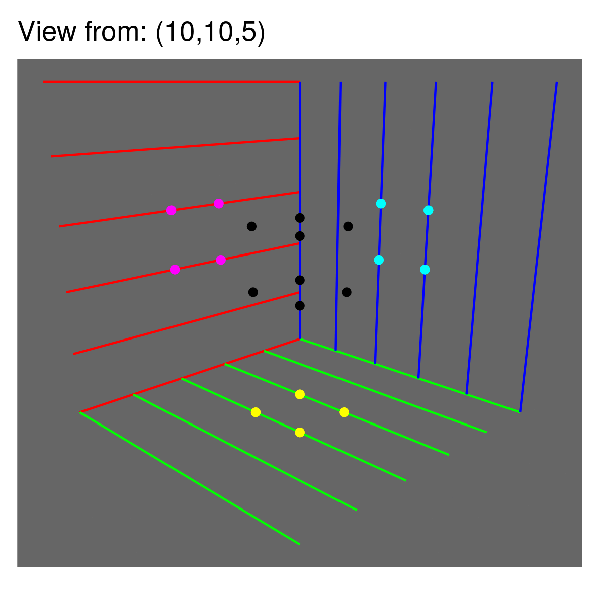
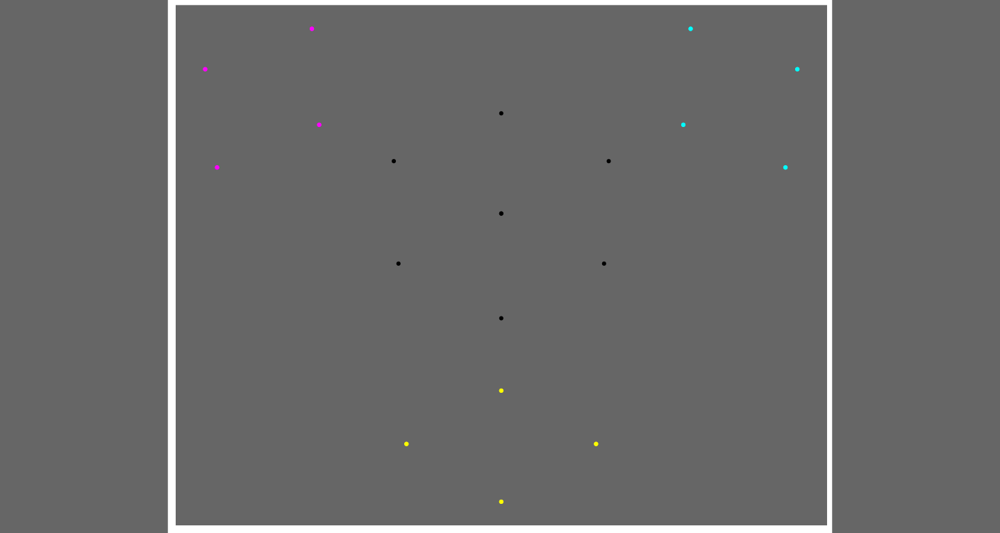
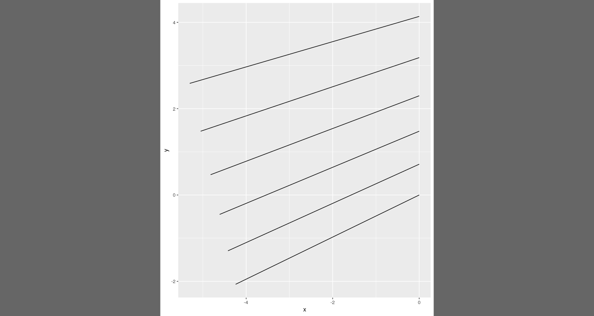
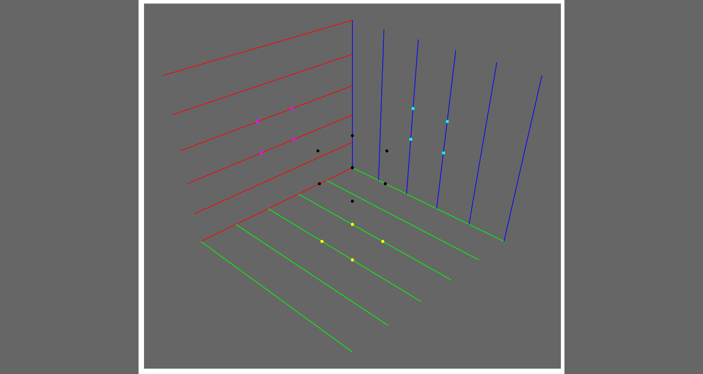

This library makes 3D geometry easy so that you can easily build 3D
plots using ggplot. The below is a set of plots built using ggplot with
the underlying data processed using this library and stitched together
into a GIF to emphasise the 3D-ness.

The functions are a little low level so you may need some programming
comfort to use it at this point. The code in the README.Rmd file should
give you some ideas on how to use it. The source code is disgusting so
go into it at your own peril. Some day it will be clean.

Bug reports are welcome! Feature requests are also welcome but this is a
side project for me so they will be worked on at a lower priority and at
author’s discretion.

Data
----

The data in this example is just a cube with eight corners specified.

<table>
<thead>
<tr class="header">
<th style="text-align: right;">x</th>
<th style="text-align: right;">y</th>
<th style="text-align: right;">z</th>
</tr>
</thead>
<tbody>
<tr class="odd">
<td style="text-align: right;">2</td>
<td style="text-align: right;">2</td>
<td style="text-align: right;">2</td>
</tr>
<tr class="even">
<td style="text-align: right;">2</td>
<td style="text-align: right;">2</td>
<td style="text-align: right;">3</td>
</tr>
<tr class="odd">
<td style="text-align: right;">2</td>
<td style="text-align: right;">3</td>
<td style="text-align: right;">2</td>
</tr>
<tr class="even">
<td style="text-align: right;">2</td>
<td style="text-align: right;">3</td>
<td style="text-align: right;">3</td>
</tr>
<tr class="odd">
<td style="text-align: right;">3</td>
<td style="text-align: right;">2</td>
<td style="text-align: right;">2</td>
</tr>
<tr class="even">
<td style="text-align: right;">3</td>
<td style="text-align: right;">2</td>
<td style="text-align: right;">3</td>
</tr>
<tr class="odd">
<td style="text-align: right;">3</td>
<td style="text-align: right;">3</td>
<td style="text-align: right;">2</td>
</tr>
<tr class="even">
<td style="text-align: right;">3</td>
<td style="text-align: right;">3</td>
<td style="text-align: right;">3</td>
</tr>
</tbody>
</table>

Shadows on the three planes
---------------------------

### Getting the coordinates in the 3D space

We calculate the shadow of the data on a plane as if the light source
was very large, and very far away from the points, perpendicular to the
plane. Think of it as the noon sun casting a shadow on the ground where
the ground is the plane. In any other situation, the shadow will be a
little distorted. Feel free to play with the parameters to see the
results

We will do this thrice, once for each plane - the XY, the YZ, and the XZ
plane.

The projection on the XY plane is:

<table>
<tbody>
<tr class="odd">
<td style="text-align: right;">1.998997</td>
<td style="text-align: right;">1.998997</td>
<td style="text-align: right;">0</td>
</tr>
<tr class="even">
<td style="text-align: right;">1.998494</td>
<td style="text-align: right;">1.998494</td>
<td style="text-align: right;">0</td>
</tr>
<tr class="odd">
<td style="text-align: right;">1.998997</td>
<td style="text-align: right;">3.001003</td>
<td style="text-align: right;">0</td>
</tr>
<tr class="even">
<td style="text-align: right;">1.998494</td>
<td style="text-align: right;">3.001506</td>
<td style="text-align: right;">0</td>
</tr>
<tr class="odd">
<td style="text-align: right;">3.001003</td>
<td style="text-align: right;">1.998997</td>
<td style="text-align: right;">0</td>
</tr>
<tr class="even">
<td style="text-align: right;">3.001506</td>
<td style="text-align: right;">1.998494</td>
<td style="text-align: right;">0</td>
</tr>
<tr class="odd">
<td style="text-align: right;">3.001003</td>
<td style="text-align: right;">3.001003</td>
<td style="text-align: right;">0</td>
</tr>
<tr class="even">
<td style="text-align: right;">3.001506</td>
<td style="text-align: right;">3.001506</td>
<td style="text-align: right;">0</td>
</tr>
</tbody>
</table>

You can see the z coordinate being zero, and the x and y coordinates
being four points repeated twice each with a minor change in the
coordinates. This difference between the almost duplicates is because
our light sources is not actually at infinity but so the change in the z
coordinates causes a really small change in the shadow’s position as
well. You can also think of it as you seeing a cube from very far away
from the same point as where the light source is. You’d almost see only
a square but in actuality there is just a little bit of the rest of the
cube that also sticks out from begind the face that you can see. Try
reducing the value of the nInfinitySubstitute variable and see the
difference.

I’d plot it but it just looks like a square which you can sort of make
out from the data so not bothering.

We similarly also calculate shadows on the other two planes

### Getting the shadow coordinates on the screen

Now that we have the 3D coordinates of the shadows, we can calculate
what it would look like when viewed from a particular point.

### Getting the data coordinates on the screen

We don’t need to do the first step for the data, since its coordinates
are what they are. So we directly calculate their project on the screen.

Plot - 1
--------

Let’s see what this looks like now

Looks sort of correct but it’s a little hard to comprehend it without
some visual guides. Let’s add some.

Visual guides
-------------

### Showing a guide for the X direction

Let us first add some line segments parallel to the X axis

Sort of looks like one of the planes, right?

Let’s repeat it for the other two planes as well

Plot - 2
--------

Better. The shadows make sense, the planes make sense, the data makes
sense.

I’ve wrapped up this code in a function,`f3DScatterPlot` and demonstrate
how this same plot comes out if you move the origin coordinate. This
function is available form the library.

The GIF is made from stitching together the outputs of plots from
different coordinates. You can get the individual plots from the
functionality in this library but stitching them together will need you
to have another program, like image magick.

Other examples
--------------

I do a lot of fooball related work so a couple of things I’ve put
together using this library in the football context -

<blockquote class="twitter-tweet">

Sneak peek into a slow moving side project - 3D views and slices of
football
pitches.<a href="https://twitter.com/hashtag/TidyTuesday?src=hash&amp;ref_src=twsrc%5Etfw">\#TidyTuesday</a>
<a href="https://twitter.com/lhashtag/ggplot2?src=hash&amp;ref_src=twsrc%5Etfw">\#ggplot2</a>
<a href="https://twitter.com/hashtag/RStats?src=hash&amp;ref_src=twsrc%5Etfw">\#RStats</a>
<a href="https://t.co/BSEba2zs9T">pic.twitter.com/BSEba2zs9T</a>

— The Come On Man (@thecomeonman)
<a href="https://twitter.com/thecomeonman/status/1288103535066746882?ref_src=twsrc%5Etfw">July
28, 2020</a>
</blockquote>

This was generated using `geom_pitch` from my other library, CodaBonito
( available her github.com/thecomeonman/CodaBonito. ) Here’s a simple
example to demonstrate usage. Play around with the arguments to get a
feel for how it works.

